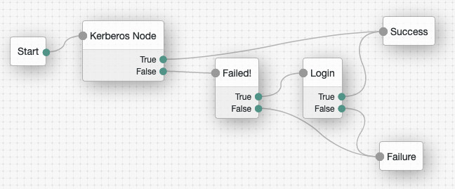
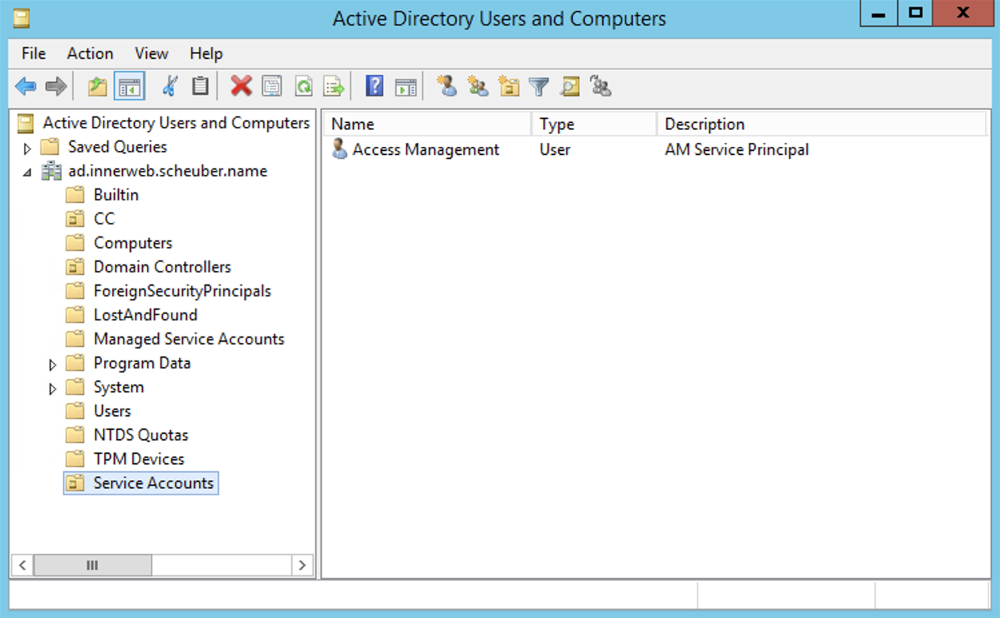
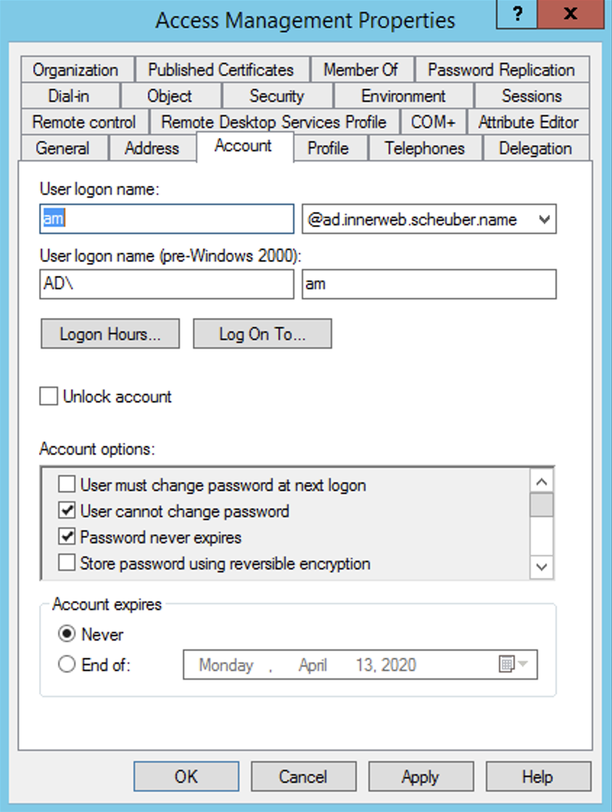
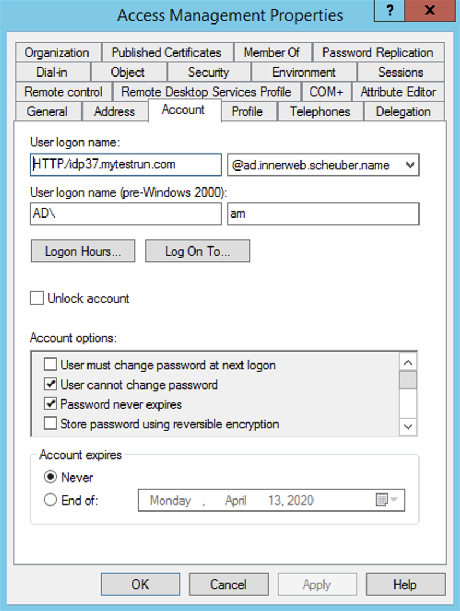
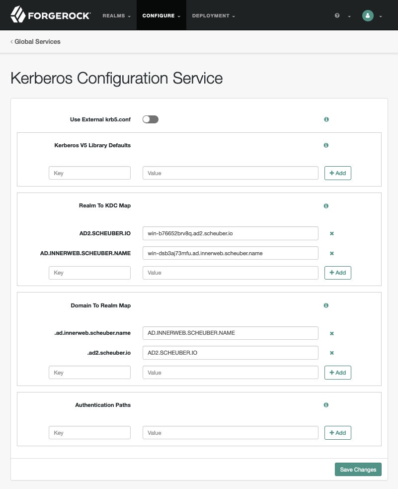
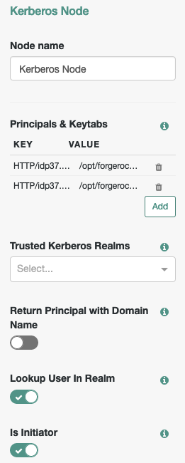

<!--
 * The contents of this file are subject to the terms of the Common Development and
 * Distribution License (the License). You may not use this file except in compliance with the
 * License.
 *
 * You can obtain a copy of the License at legal/CDDLv1.0.txt. See the License for the
 * specific language governing permission and limitations under the License.
 *
 * When distributing Covered Software, include this CDDL Header Notice in each file and include
 * the License file at legal/CDDLv1.0.txt. If applicable, add the following below the CDDL
 * Header, with the fields enclosed by brackets [] replaced by your own identifying
 * information: "Portions copyright [year] [name of copyright owner]".
 *
 * Copyright 2020 ForgeRock AS.
-->

# Kerberos Node
Provide single sign-on services for Kerberos realms like Microsoft Active Directory domain environments.

A Kerberos authentication node for ForgeRock's Identity Platform 6.5.2 and above. The node recognizes and validates
Kerberos tokens. The web browser presents a Kerberos token to ForgeRock's Access Management (AM) through the Simple and
Protected GSS-API Negotiation Mechanism (SPNEGO) protocol. The Kerberos node enables desktop single sign on such 
that a user who has already authenticated with a Kerberos Key Distribution Center can use that existing login and
authenticate to AM without having to provide the login information again. Users might need to set up Integrated 
Windows Authentication in Internet Explorer or Microsoft Edge to benefit from single sign on when logged on to a
Windows desktop.

*Why would you used this node over the <a href="https://github.com/FrankGasparovic/Windows-Desktop-SSO-Node">Windows Desktop SSO Node</a>? The current version of the WDSSO node is not thread safe. 
If you run multiple instances of the node with different configurations across multiple trees, you will see 
unpredictable behavior and errors. This will worsen the heavier the load is. Additionally, The WDSSO node requires 
domains to have a trust relationship in order for multi-domain logins to work. The Kerberos node remedies both of 
those issues.*

Download a release build fom the *release* tab or clone this repository to build your own release. Copy the .jar 
file from your download location or the *./target* directory (if you built it yourself) into the 
*../web-container/webapps/openam/WEB-INF/lib* directory where AM is deployed.  Restart the web container to pick 
up the new node.  The node will then appear in the authentication trees components palette.

## Related Nodes
- <a href="https://github.com/FrankGasparovic/Windows-Desktop-SSO-Node">Windows Desktop SSO Node</a>

## Usage
This node supports any of the following scenarios:

1. Single Active Directory Domain / Single Kerberos Realm
2. Multiple Active Directory Domains `With` Domain Trusts / Multiple Kerberos Realms `With` Cross-Realm Secrets
3. Multiple Active Directory Domains `Without` Domain Trusts / Multiple Kerberos Realms `Without` Cross-Realm Secrets

### Sample Flow
This example flow showcases the Kerberos Node being used as the first node in the flow. If the node can successfully extract and validate a Kerberos token from the browser request, the flow will take the "true" exit. If no Kerberos token is found or an invalid token is found, the flow will take the "false" exit and prompt the user to authenticate the traditional way.



## Configuration
The Kerberos node requires the following pieces of configuration and artifacts to function properly:

* A service principal account in each Kerberos realm (=Active Directory domain) used for token validation. The name of the service principal must be the DNS name of the AM instance/cluster/server hosting the Kerberos node.
* DNS A-record pointing to the AM server host name used for the service principal.
* A keytab file for each service principal account stored on the AM server instance.
* A list of all the Kerberos realms and their KDCs
* A list of domain names and which Kerberos realm they map to

### Settings
The configuration is split between a global Kerberos Configuration Service in AM and the node configuration. The parameters configured in the global service apply to all the nodes across all the AM realms. The underlying Java Kerberos implementation is applying these settings JVM-wide. The remaining node settings apply only to the particular node instance, thus allowing individual node behavior amid the global settings.

<table cellspacing="10" width="100%">
  <tr>
  	<th align="left" colspan="2">Kerberos Node Settings</th>
  </tr>
  <tr>
  	<td width="20%">Principals & Keytabs</td>
  	<td>Specify a list of service principals in the key column and their respective keytab file names in the value column. The format of the service principal must be:<br><br><code>HTTP/openam.forgerock.com@AD_DOMAIN.COM</code>. Note the lower case service name before the @ sign and the UPPER CASE Kerberos realm name, which typically aligns with the Active Directory domain name. The principal name can be set to "*" when <code>Is Initiator</code> is false. In this case, the acceptor is not bound to a single principal. It can act as any principal an initiator requests if keys for that principal can be found. When <code>Is Initiator</code> is true, the service principal name cannot be set to "*".</td>
  </tr>
  <tr>
  	<td valign="top">Trusted Kerberos Realms</td>
  	<td>White list of trusted Kerberos Realms for user Kerberos tickets. If the list is empty, Kerberos tickets from all realms are accepted. In a setup where multiple Active Directory domains are connected through domain trusts, a subset of trusted domains can be explicitly white listed and only users from those domains will be able to login. Note that this setting takes Kerberos realm names, which are usually UPPERCASED DOMAIN NAMES.</td>
  </tr>
  <tr>
  	<td valign="top">Return Principal with Domain Name</td>
  	<td>Return the fully qualified name of the authenticated user rather than just the username.</td>
  </tr>
  <tr>
  	<td valign="top">Lookup User In Realm</td>
  	<td>Validate that the user has a matched user profile configured in the current AM realm's data store.</td>
  </tr>
  <tr>
  	<td valign="top">Is Initiator</td>
  	<td>Set this to true, if initiator. Set this to false, if acceptor only. (Default is true). Note: Do not set this value to false for initiators. The principal name can be set to "*" when <code>Is Initiator</code> is false. In this case, the acceptor is not bound to a single principal. It can act as any principal an initiator requests if keys for that principal can be found. When <code>Is Initiator</code> is true, the service principal name cannot be set to "*".</td>
  </tr>
  <tr>
  	<th align="left" colspan="2"/>
  </tr>
  <tr>
  	<th align="left" colspan="2">Kerberos Configuration Service Settings</th>
  </tr>
  <tr>
  	<td valign="top">Use External krb5.conf</td>
  	<td>Enabling this setting instructs the nodes to ignore all the settings below. Settings on this page only apply when this option is disabled (default). If enabled, the service attempts to locate a krb5.conf file on the AM server as follows:<ul><li>If the system property java.security.krb5.conf is set, its value is assumed to specify the path and file name.</li><li>If that system property value is not set, then the configuration file is looked for in the directory</li><ul><li><code>{java-home}\lib\security</code> (Windows)</li><li><code>{java-home}/lib/security</code> (Solaris and Linux)</li></ul><li>If the file is still not found, then an attempt is made to locate it as follows:</li><ul><li><code>/etc/krb5/krb5.conf</code> (Solaris)</li><li><code>c:\winnt\krb5.ini</code> (Windows)</li><li><code>/etc/krb5.conf</code> (Linux)</li></ul></ul><p>See the <a href="https://web.mit.edu/kerberos/krb5-1.12/doc/admin/conf_files/krb5_conf.html#capaths">full documentation of the krb5.conf file</a>.</td>
  </tr>
  <tr>
  	<td valign="top">Kerberos V5 Library Defaults</td>
  	<td>Settings used by the Kerberos V5 library. This setting corresponds to the <code>[libdefaults]</code> section in the <a href="https://web.mit.edu/kerberos/krb5-1.12/doc/admin/conf_files/krb5_conf.html#libdefaults">krb5.conf</a> file. Unless you have specific reasons to populate this section, leave it empty.</td>
  </tr>
  <tr>
  	<td valign="top">Realm To KDC Map</td>
  	<td>Realm-specific contact information and settings. This setting corresponds to the <code>[realms]</code> section in the <a href="https://web.mit.edu/kerberos/krb5-1.12/doc/admin/conf_files/krb5_conf.html#realms">krb5.conf</a> file.</td>
  </tr>
  <tr>
  	<td valign="top">Domain To Realm Map</td>
  	<td>Maps server hostnames and Active Directory domains to Kerberos realms. This setting corresponds to the <code>[domain_realm]</code> section in the <a href="https://web.mit.edu/kerberos/krb5-1.12/doc/admin/conf_files/krb5_conf.html#domain-realm">krb5.conf</a> file.</td>
  </tr>
  <tr>
  	<td valign="top">Authentication Paths</td>
  	<td>Authentication paths for non-hierarchical cross-realm. This setting corresponds to the <code>[capaths]</code> section in the <a href="https://web.mit.edu/kerberos/krb5-1.12/doc/admin/conf_files/krb5_conf.html#capaths">krb5.conf</a> file. Unless you need to configure direct (non-hierarchical) cross-realm authentication, leave this empty.</td>
  </tr>
</table>

### Create Service Principal Account And KeyTab File
Create a user in Active Directory to be your service principal. 



Choose a regular username for the account, you will need to reference that username later on when generating the keytab file.



Disallow changes to the password and make sure it doesn't get reset. If it does, you will need to re-generate the keytab file.

To generate a valid Kerberos keytab file for the service account, use the following <code>ktpass</code> command: 
<pre>
ktpass -out idp37_2.keytab -princ HTTP/idp37.mytestrun.com@AD.INNERWEB.SCHEUBER.NAME -pass +rndPass -maxPass 256 -mapuser am@ad.innerweb.scheuber.name -ptype KRB5_NT_PRINCIPAL -kvno 0
Targeting domain controller: WIN-DSB3AJ73MFU.ad.innerweb.scheuber.name
Successfully mapped HTTP/idp37.mytestrun.com to am.
Password successfully set!
Key created.
Output keytab to idp37_2.keytab:
Keytab version: 0x502
keysize 85 HTTP/idp37.mytestrun.com@AD.INNERWEB.SCHEUBER.NAME ptype 1 (KRB5_NT_PRINCIPAL) vno 0 etype 0x17 (RC4-HMAC) ke
ylength 16 (0x848b2f5caa674cc0e30ab8ba22efd14f)
</pre>

After the <code>ktpass</code> command, your user's account information will have changed:



Now move or copy the generated keytab file to the AM server. You will need to reference it by its full name and path in the node settings.

## Sample Configuration
The following configuration options showcase scenario #3 from above: Multiple Active Directory Domains `Without` Domain Trusts / Multiple Kerberos Realms `Without` Cross-Realm Secrets.

### Service Configuration



### Node Configuration



### Tree Configuration


## Common Errors

1. Kerberos relies on DNS for entity resolution. All records for servers involved in the flow must be A records, not
 CNAME records.
 2. You may see the below errors in the AM log files:
```
ERROR: Exception thrown trying to authenticate the user
GSSException: Failure unspecified at GSS-API level (Mechanism level: Invalid argument (400) - Cannot find key of appropriate type to decrypt AP REP - RC4 with HMAC)
```

One potential fix to this issue is to regenerate the AM service keytab file without the `-crypto AES256-SHA1`. The keytab command would then be: 

```
ktpass -out fileName.keytab -princ HTTP/openam.forgerock.com@AD_DOMAIN.COM -pass +rdnPass -maxPass 256 -mapuser amKerberos@frdpcloud.com -ptype KRB5_NT_PRINCIPAL -kvno 0
```
